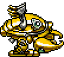

# Heavy Lobster (Rivals of Aether)
Heavy Lobster from the Kirby series, implemented as a playable Steam Workshop character in Rivals of Aether.

 
**Can be downloaded + played through the Steam Workshop here: \
https://steamcommunity.com/workshop/filedetails/?id=2613965693**

Repository contains all files accessible through the Steam Workshop above and necessary to play the character, consisting of original scratch spritework and animation as well as original scripts for normal and special moves and their properties and logic.

Scripts written in GML (Game Maker Language) to work alongside Rivals of Aether. \
Sprites custom-created and animated in Adobe Photoshop, based on the original sprite designs in Kirby Super Star. \
Sounds used and edited originally from Kirby Super Star Ultra.

---

Heavy Lobster and associated sounds, and Kirby Super Star are (C) Nintendo.
